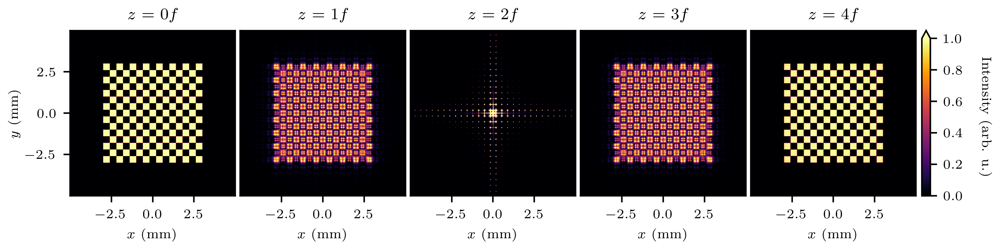

.. raw:: html

   <style>
   .bd-sidebar-secondary {
       display: none;
   }
   </style>

.. toctree::
   :hidden:

   getting_started/index
   auto_examples/index
   Reference <reference/index>
   background/index

TorchOptics Documentation
==========================

TorchOptics is an open-source Python library for differentiable wave optics simulations with PyTorch.

.. note::
    **Documentation is currently being developed.** For detailed information about the library, please refer to the `arXiv paper <https://arxiv.org/abs/2411.18591>`_.

Key Features
------------

.. grid:: 1 2 2 3
   :gutter: 2

   .. grid-item-card:: 🌊 **Differentiable Wave Optics Simulations**
      :class-card: sd-bg-light sd-border sd-shadow

      A comprehensive framework for modeling, analyzing, and designing optical systems using differentiable Fourier optics.

   .. grid-item-card:: 🔥 **Built on PyTorch**
      :class-card: sd-bg-light sd-border sd-shadow

      Leverages PyTorch for GPU acceleration, batch processing, automatic differentiation, and efficient gradient-based optimization.  

   .. grid-item-card:: 🛠️ **End-to-End Optimization**
      :class-card: sd-bg-light sd-border sd-shadow

      Enables optimization of optical hardware and deep learning models within a unified, differentiable pipeline.

   .. grid-item-card:: 🔬 **Optical Elements**
      :class-card: sd-bg-light sd-border sd-shadow

      Features standard optical elements like modulators, lenses, detectors, and polarizers.

   .. grid-item-card:: 🖼️ **Spatial Profiles**
      :class-card: sd-bg-light sd-border sd-shadow

      Includes commonly used spatial profiles such as Hermite-Gaussian and Laguerre-Gaussian beams for advanced optical applications.

   .. grid-item-card:: 🔆 **Polarized Light & Spatial Coherence**
      :class-card: sd-bg-light sd-border sd-shadow

      Supports simulations of polarized light and optical fields with arbitrary spatial coherence.

Installation
------------

TorchOptics and its dependencies can be installed using `pip <https://pypi.org/project/torchoptics/>`_:

.. code-block:: bash

    pip install torchoptics

For development mode, clone the GitHub repository and install it in editable mode:

.. code-block:: bash

    git clone https://github.com/MatthewFilipovich/torchoptics
    pip install -e ./torchoptics

Usage
-----

.. image:: https://colab.research.google.com/assets/colab-badge.svg
   :target: https://colab.research.google.com/github/MatthewFilipovich/torchoptics/blob/main/docs/source/tutorials/4f_system.ipynb
   :alt: Open in Colab

This example demonstrates how to simulate a 4f imaging system using TorchOptics. The field at each focal plane along the z-axis is computed and visualized:

.. code-block:: python

    import torch
    import torchoptics
    from torchoptics import Field, System
    from torchoptics.elements import Lens
    from torchoptics.profiles import checkerboard

    # Set simulation properties
    shape = 1000  # Number of grid points in each dimension
    spacing = 10e-6  # Spacing between grid points (m)
    wavelength = 700e-9  # Field wavelength (m)
    focal_length = 200e-3  # Lens focal length (m)
    tile_length = 400e-6  # Checkerboard tile length (m)
    num_tiles = 15  # Number of tiles in each dimension

    # Determine device
    device = "cuda" if torch.cuda.is_available() else "cpu"

    # Configure default properties
    torchoptics.set_default_spacing(spacing)
    torchoptics.set_default_wavelength(wavelength)

    # Initialize input field with checkerboard pattern
    field_data = checkerboard(shape, tile_length, num_tiles)
    input_field = Field(field_data).to(device)

    # Define 4f optical system with two lenses
    system = System(
        Lens(shape, focal_length, z=1 * focal_length),
        Lens(shape, focal_length, z=3 * focal_length),
    ).to(device)

    # Measure field at focal planes along the z-axis
    measurements = [
        system.measure_at_z(input_field, z=i * focal_length)
        for i in range(5)
    ]

    # Visualize the measured intensity distributions
    for i, measurement in enumerate(measurements):
        measurement.visualize(title=f"z={i}f", vmax=1)



   Intensity distributions at different focal planes in the 4f system.

.. figure:: _static/4f_propagation.gif
   :width: 300px
   :align: center
   
   Propagation of the intensity distribution.

Contributing
--------------

We welcome bug reports and suggestions for future features and enhancements. To contribute a feature, please follow these steps:

1. **Fork the repository**: Go to `https://github.com/MatthewFilipovich/torchoptics/fork <https://github.com/MatthewFilipovich/torchoptics/fork>`_
2. **Create a feature branch**: ``git checkout -b feature/fooBar``
3. **Commit your changes**: ``git commit -am 'Add some fooBar'``
4. **Push to the branch**: ``git push origin feature/fooBar```
5. **Submit a Pull Request**: Open a Pull Request on GitHub

Citing TorchOptics
-------------------

If you are using TorchOptics for research purposes, we kindly request that you cite the following paper:

    M.J. Filipovich and A.I. Lvovsky, *TorchOptics: An open-source Python library for differentiable Fourier optics simulations*, arXiv preprint `arXiv:2411.18591 <https://arxiv.org/abs/2411.18591>`_ (2024).

License
-------

TorchOptics is distributed under the MIT License. See the `LICENSE <https://github.com/MatthewFilipovich/torchoptics/blob/main/LICENSE>`_ file for more details.